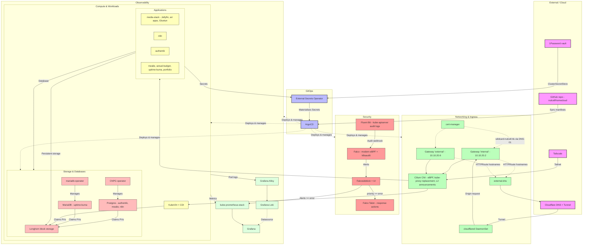
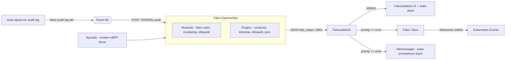
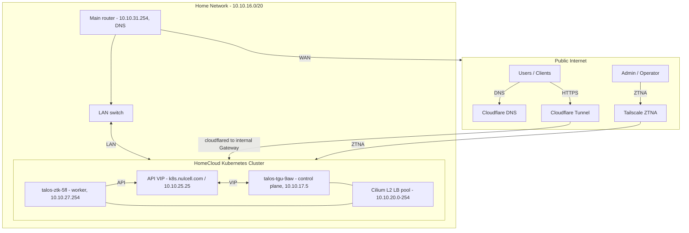

# HomeCloud

Self-hosted private cloud on bare metal. Talos + Cilium + ArgoCD + Longhorn + KubeVirt.

Two nodes today (1 control plane with scheduling on, 1 worker), designed to scale to a 3-node HA control plane.

## Layout

| Path                                   | Purpose                                                                                                           |
| -------------------------------------- | ----------------------------------------------------------------------------------------------------------------- |
| [`cluster/`](cluster/)                 | Talos machine configs + imperative bootstrap (Cilium, ArgoCD). Start at [`cluster/README.md`](cluster/README.md). |
| [`gitops/`](gitops/)                   | ArgoCD's source of truth - root, infrastructure, operators, security, services, apps.                             |
| [`charts/`](charts/)                   | Helm umbrella charts referenced by `gitops/apps/*`.                                                               |
| [`manifests/`](manifests/)             | Ad-hoc / one-shot manifests, applied manually. Not reconciled by ArgoCD.                                          |
| [`scripts/`](scripts/)                 | Standalone operator utilities.                                                                                    |
| [`network/netboot/`](network/netboot/) | netboot.xyz + ProxyDHCP install notes for the planned provisioning host. Not deployed.                            |
| [`renovate.json5`](renovate.json5)     | Renovate config; the weekly run lives in [`.github/workflows/renovate.yml`](.github/workflows/renovate.yml).      |

Conventions for agents and humans: [CLAUDE.md](CLAUDE.md).

## Setup

```bash
brew install mise op
mise install   # everything pinned in .mise.toml
```

`op` (1Password CLI) is the only required tool not managed by mise. It seeds the External Secrets service-account token during bootstrap and backs the `op://homecloud/...` URIs used in `.env` generation.

## What's running

Versions live next to the manifests - `gitops/*/*/kustomization.yaml` for chart versions, [`cluster/bootstrap/install.sh`](cluster/bootstrap/install.sh) for Cilium / Gateway API / ArgoCD.

| Layer                                              | Deployed                                                                                                                                                           |
| -------------------------------------------------- | ------------------------------------------------------------------------------------------------------------------------------------------------------------------ |
| [`infrastructure/`](gitops/infrastructure/) wave 0 | cert-manager, external-dns, external-secrets, gateway, headlamp, infra-app-httproutes, kube-prometheus-stack, loki, longhorn, metrics-server, registry-credentials |
| [`operators/`](gitops/operators/) wave 5           | cnpg, falco, kubevirt, mariadb, tailscale                                                                                                                          |
| [`security/`](gitops/security/) wave 10            | falco                                                                                                                                                              |
| [`services/`](gitops/services/) wave 15            | kubevirt (KubeVirt + CDI CRs)                                                                                                                                      |
| [`apps/`](gitops/apps/) wave 100                   | actual-budget, authentik, cloudflared, mealie, media-stack, n8n, portfolio, uptime-kuma                                                                            |

[`gitops/exprimental/`](gitops/exprimental/) is a staging area - no ApplicationSet reads it, so nothing in it runs. It currently holds homarr, homepage, outline, speedtest-tracker, rancher, seaweedfs, kubescape, trivy, an alternate falco layout, and a SOPS example secret.

## Roadmap

- [x] Talos cluster - 1 control plane (scheduling on) + 1 worker.
- [x] Infrastructure:
  - [x] [Cilium](https://cilium.io/) CNI with eBPF datapath (no kube-proxy).
  - [x] [Cilium Gateway API](https://docs.cilium.io/en/stable/network/servicemesh/gateway-api/gateway-api/) - `internal` and `external` Gateways, L2-announced on the LAN.
  - [x] [ArgoCD](https://argoproj.github.io/cd/) for GitOps.
  - [x] [External Secrets](https://external-secrets.io/) + 1Password as the runtime secret path.
  - [x] [external-dns](https://github.com/kubernetes-sigs/external-dns) for dynamic DNS records via Cloudflare.
  - [x] [cert-manager](https://cert-manager.io/) for TLS certificates (DNS-01).
  - [x] [Longhorn](https://longhorn.io/) for replicated block storage.
  - [x] [kube-prometheus-stack](https://github.com/prometheus-operator/kube-prometheus) for metrics, alerting and Grafana.
  - [x] [Grafana Loki](https://grafana.com/oss/loki/) + [Alloy](https://grafana.com/docs/alloy/) for log aggregation.
  - [x] [Headlamp](https://headlamp.dev/) in-cluster.
  - [x] [KubeVirt](https://kubevirt.io/) + CDI for VMs on Kubernetes.
  - [x] [CNPG](https://cloudnativepg.io/) for Postgres, [mariadb-operator](https://github.com/mariadb-operator/mariadb-operator) for MariaDB.
  - [x] [Tailscale operator](https://tailscale.com/kb/1236/kubernetes-operator) for remote access.
  - [x] [Renovate](https://docs.renovatebot.com/) for chart and image versions.
  - [ ] [SOPS](https://github.com/getsops/sops) re-wired into ArgoCD - the config is in-repo but the ksops CMP is not installed. See [cluster/docs/argocd.md](cluster/docs/argocd.md#secrets).
- [x] Applications:
  - [x] Media stack - Jellyfin, Seerr, Radarr, Sonarr, Bazarr, Prowlarr, qBittorrent behind Gluetun.
  - [x] [n8n](https://n8n.io/) for workflow automation.
  - [x] [Authentik](https://goauthentik.io/) for SSO.
  - [x] [Mealie](https://mealie.io/) recipes, [Actual Budget](https://actualbudget.org/), [Uptime Kuma](https://uptime.kuma.pet/).
  - [x] [Cloudflare Tunnel](https://developers.cloudflare.com/cloudflare-one/networks/connectors/cloudflare-tunnel/) publishing internal apps to the internet.
  - [x] Portfolio website - Astro + nginx on `nulcell.com`.
- [ ] Serverless and Messaging:
  - [ ] [RabbitMQ Operator](https://github.com/rabbitmq/cluster-operator) for messaging.
  - [ ] [Knative Operators](https://knative.dev/docs/install/operator/knative-with-operators/) for serverless workloads.
    - [ ] [Serving](https://knative.dev/docs/serving/) for request-driven autoscaling.
    - [ ] [Eventing](https://knative.dev/docs/eventing/) for event-driven architecture.
    - [ ] [RabbitMQ plugin](https://knative.dev/docs/install/eventing/rabbitmq-install/) for messaging events.
- [ ] Security tooling:
  - [x] [Falco](https://falco.org/) (modern eBPF) + [Falcosidekick](https://github.com/falcosecurity/falcosidekick) + [Falco Talon](https://docs.falco-talon.org/) for runtime detection and automated response.
  - [ ] [Kyverno](https://kyverno.io/) for policy enforcement and configuration validation. See [gitops/security/README.md](gitops/security/README.md).
  - [ ] [Policy Reporter](https://kyverno.github.io/policy-reporter/) for aggregating `PolicyReport` CRDs.
- [ ] Provisioning:
  - [ ] Terraform + Terragrunt for cluster bootstrap, replacing [`cluster/bootstrap/install.sh`](cluster/bootstrap/install.sh).
  - [ ] Pi-hole (DNS + DHCP) + netboot + Tailscale on a Raspberry Pi for bare-metal provisioning.
- [ ] Testing:
  - [ ] [Kube-monkey](https://github.com/asobti/kube-monkey) for chaos testing.
- [ ] Backups:
  - [ ] [Velero](https://velero.io/) for cluster state and persistent volume backups.
  - [ ] [AWS S3](https://aws.amazon.com/s3/) for Longhorn volume backups and Velero backup storage.
- [ ] HA home cluster.
  - [ ] 2.5GbE network upgrade for cluster nodes.
  - [ ] Dedicated control-plane nodes with similar mini-pcs (1 -> 3, never 2).
  - [ ] 2-3 additional workers with other hardware.

## Architecture

### Deployed components



### Runtime security



### Hardware layout


