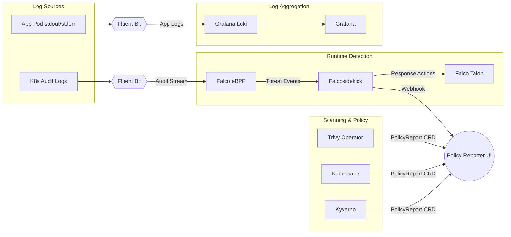
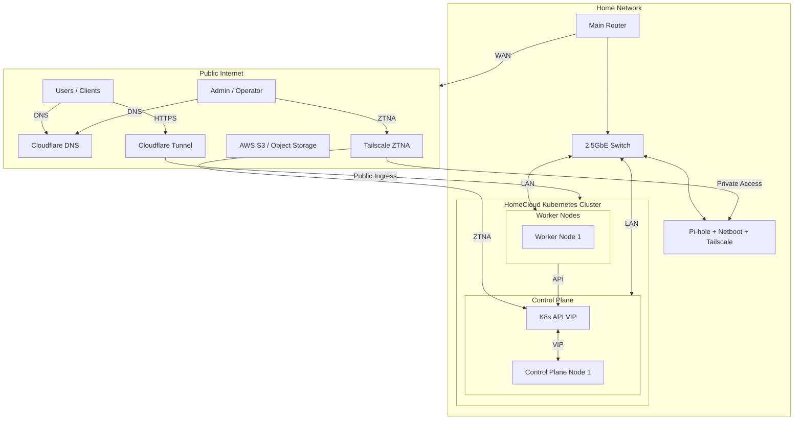

# HomeCloud

Self-hosted private cloud on bare metal. Talos + Cilium + ArgoCD + Longhorn + KubeVirt.

## Layout

| Path                                   | Purpose                                                                                                           |
| -------------------------------------- | ----------------------------------------------------------------------------------------------------------------- |
| [`cluster/`](cluster/)                 | Talos machine configs + imperative bootstrap (Cilium, ArgoCD). Start at [`cluster/README.md`](cluster/README.md). |
| [`gitops/`](gitops/)                   | ArgoCD's source of truth - root, infrastructure, security, apps.                                                  |
| [`charts/`](charts/)                   | Helm umbrella charts referenced by `gitops/apps/*`.                                                               |
| [`manifests/`](manifests/)             | Ad-hoc / one-shot manifests, applied manually.                                                                    |
| [`scripts/`](scripts/)                 | Standalone operator utilities.                                                                                    |
| [`network/netboot/`](network/netboot/) | Raspberry Pi netboot setup (Pi-hole, Tailscale, DHCP/DNS).                                                        |

Conventions for agents and humans: [AGENTS.md](AGENTS.md).

## Setup

```bash
brew install mise op
mise install   # everything pinned in .mise.toml
```

`op` (1Password CLI) is the only required tool not managed by mise - it backs the `op://homecloud/...` URIs used in `.env` generation.

## Roadmap

- [x] Single control-plane Talos node with 1 worker.
- [x] Infrastructure:
  - [x] [Cilium](https://cilium.io/) CNI with eBPF datapath (no kube-proxy).
  - [x] [Cilium Gateway API](https://docs.cilium.io/en/stable/k8s/gateway-api/).
  - [x] [SOPS](https://github.com/mozilla/sops) for secret encryption management in GitOps.
  - [x] [ArgoCD](https://argoproj.github.io/cd/) for GitOps.
  - [x] [external-dns](https://github.com/kubernetes-sigs/external-dns) for dynamic DNS records via Cloudflare.
  - [x] [cert-manager](https://cert-manager.io/) for TLS certificates.
  - [x] [Longhorn](https://longhorn.io/) for distributed block storage.
  - [x] [SeaweedFS Operator](https://github.com/seaweedfs/seaweedfs-operator) for distributed file/object storage.
  - [x] [Kube-prometheus-stack](https://github.com/prometheus-operator/kube-prometheus) for monitoring.
  - [x] [KubeVirt](https://kubevirt.io/) for VMs on Kubernetes.
  - [x] [CNPG Operator](https://cloudnativepg.io/) for Postgres on Kubernetes.
  - [x] [Grafana Loki](https://grafana.com/oss/loki/) + [Fluent Bit](https://fluentbit.io/) for log aggregation (media, n8n, authentik, actual-budget).
  - [ ] [Headlamp](https://headlamp.dev/) in-cluster deployment (currently using desktop app; manifests in `gitops/exprimental/infrastructure/headlamp/`).
- [ ] Serverless and Messaging:
  - [ ] [RabbitMQ Operator](https://github.com/rabbitmq/rabbitmq-operator) for messaging.
  - [ ] [Knative Operators](https://knative.dev/docs/install/operator/knative-with-operators/) for serverless workloads.
    - [ ] [Serving](https://knative.dev/docs/serving/) for request-driven autoscaling.
    - [ ] [Eventing](https://knative.dev/docs/eventing/) for event-driven architecture.
    - [ ] [RabbitMQ plugin](https://knative.dev/docs/install/eventing/rabbitmq-install/) for messaging events.
- [ ] Applications:
  - [x] Media stack - Jellyfin, Seerr, Radarr, Sonarr, Bazarr, Prowlarr, Gluetun.
  - [x] [N8N](https://n8n.io/) for workflow automation.
  - [x] [Homepage](https://github.com/gethomepage/homepage) for Dashboards.
  - [ ] [Cloudflare Tunnel](https://developers.cloudflare.com/cloudflare-one/networks/connectors/cloudflare-tunnel/deployment-guides/kubernetes/) for making internal applications publicly available. Pair with [loadbalancer](https://developers.cloudflare.com/load-balancing/private-network/public-to-tunnel/)
  - [ ] Portfolio website - VitePress + Cloudflare tunnel on `portfolio.nulcell.com`.
- [x] Security Tooling:
  - [x] [Falco](https://falco.org/) (via modern eBPF) + [Falcosidekick](https://github.com/falcosecurity/falcosidekick) + [Falco Talon](https://docs.falco-talon.org/) for runtime security monitoring and automated response.
  - [x] [Trivy Operator](https://github.com/aquasecurity/trivy-operator) for vulnerability and configuration scanning.
  - [x] [Kubescape](https://kubescape.io/) for cluster security posture assessment (CSPM).
  - [ ] [Kyverno](https://kyverno.io/) for policy enforcement and configuration validation.
  - [ ] [Policy Reporter](https://kyverno.github.io/policy-reporter/) for aggregating policy violations from Trivy, Kubescape, and Kyverno.
  - [ ] [Secrets Store CSI Driver](https://github.com/kubernetes-sigs/secrets-store-csi-driver) + [Vault Provider](https://github.com/hashicorp/vault-csi-provider) for dynamic secrets management.
- [ ] Testing:
  - [ ] [Kube-monkey](https://github.com/asobti/kube-monkey) for chaos testing.
- [ ] Backups:
  - [ ] [Velero](https://velero.io/) for cluster state and persistent volume backups.
  - [ ] [AWS S3](https://aws.amazon.com/s3/) for Longhorn volume backups and Velero backup storage.
- [ ] HA home cluster.
  - [ ] 2.5GbE network upgrade for cluster nodes.
  - [ ] Dedicated control-plane nodes with similar mini-pcs.
  - [ ] 2-3 additional workers with other hardware.

## Architecture

### High-level Component Architecture Diagram

```mermaid
flowchart TD
    %% Define styles and classes
    classDef external fill:#f9f,stroke:#333,stroke-width:2px;
    classDef gitops fill:#bbf,stroke:#333,stroke-width:2px;
    classDef routing fill:#bfb,stroke:#333,stroke-width:1px;
    classDef compute fill:#ffb,stroke:#333,stroke-width:1px;
    classDef storage fill:#fbb,stroke:#333,stroke-width:1px;
    classDef security fill:#f99,stroke:#333,stroke-width:1px;
    classDef obs fill:#dfd,stroke:#333,stroke-width:1px;

    %% External Infrastructure
    subgraph Ext ["External / Cloud Infrastructure"]
        GH[GitHub / GitLab Repository]:::external
        CF[Cloudflare DNS & Tunnels]:::external
        S3[AWS S3 / Object Storage]:::external
    end

    %% GitOps & Control Plane
    subgraph GitOps ["GitOps & Orchestration"]
        Argo[ArgoCD]:::gitops
        SOPS[SOPS Encrypted Secrets]:::gitops
        GH -->|Sync Manifests| Argo
        SOPS -.->|Decrypts on Sync| Argo
    end

    %% Ingress & Routing Layer
    subgraph Networking ["Networking & Ingress"]
        CGW[Cilium Gateway API]:::routing
        Cilium[Cilium CNI - eBPF Datapath]:::routing
        ExtDNS[External-DNS]:::routing
        CertMan[Cert-Manager]:::routing
        
        CF -->|Traffic Ingress| CGW
        CGW --> Cilium
        CGW -.->|Triggers DNS Records| ExtDNS --> CF
        CGW -.->|Requests TLS| CertMan
    end

    %% Storage & Stateful Tier
    subgraph DataStore ["Storage & Databases"]
        LH[Longhorn Block Storage]:::storage
        SFS[SeaweedFS Operator]:::storage
        SFSC[SeaweedFS Cluster]:::storage
        CNPG[CNPG Postgres Operator]:::storage
        PGDB[Postgres Database]:::storage
        RMQ[RabbitMQ Operator]:::storage
        RMQC[RabbitMQ Cluster]:::storage
        Vault[Vault Operator + Secrets CSI]:::storage
        
        SFS -->|Manages Lifecycle| SFSC
        CNPG -->|Manages Lifecycle| PGDB
        RMQ -->|Manages Lifecycle| RMQC

        SFSC -->|Claims PVs| LH
        PGDB -->|Claims PVs| LH
        RMQC -->|Claims PVs| LH
    end

    %% Compute & Workloads
    subgraph Compute ["Compute & Workloads"]
        KVirt[KubeVirt VMs]:::compute
        
        subgraph Knative ["Knative Serverless"]
            KServe[Knative Serving - Autoscaling]:::compute
            KEvent[Knative Eventing]:::compute
            KRMQ[RabbitMQ Plugin]:::compute
            KEvent <--> KRMQ <--> RMQC
        end

        subgraph Apps ["Applications"]
            Media[Media Stack: Jellyfin, Radarr, etc.]:::compute
            N8N[N8N Automation]:::compute
            Homepage[Homepage Dashboard]:::compute
            VP[VitePress Portfolio]:::compute
        end

        Cilium --> KServe
        Cilium --> Apps
        Cilium --> KVirt
        
        Apps -->|Mounts Dynamic Secrets| Vault
        Apps -->|Persistent Storage| LH
        Apps -->|File/Object Storage| SFSC
        Apps -->|Database Queries| PGDB
        N8N <--> KEvent
        CF -->|Direct Tunnel| VP
    end

    %% Security & Governance Framework
    subgraph SecLayer ["Security Framework"]
        Kyverno[Kyverno Policy Engine]:::security
        Falco[Falco eBPF Runtime]:::security
        FSide[Falcosidekick + Talon]:::security
        Trivy[Trivy Operator]:::security
        KScape[Kubescape CSPM]:::security
        PolRep[Policy Reporter UI]:::security

        Kyverno -.->|Validates/Enforces| Compute
        Falco -->|Alerts| FSide --> PolRep
        Trivy -->|Reports| PolRep
        KScape -->|Reports| PolRep
    end

    %% Observability & Operations
    subgraph Observability ["Observability & Operations"]
        KPM[Kube-Prometheus-Stack]:::obs
        Loki[Grafana Loki]:::obs
        FB[Fluent Bit Log Agent]:::obs
        KMonk[Kube-Monkey Chaos]:::obs

        Compute -->|Metrics| KPM
        Compute -->|Logs| FB
        FB -->|App Logs| Loki
        Loki -.->|Log Datasource| KPM
        KMonk -.->|Disrupts Pods| Compute
    end

    %% Backups
    subgraph Recovery ["Disaster Recovery"]
        Velero[Velero]:::storage
        Velero -->|Cluster State & Volume Snapshots| S3
        LH -->|Asynchronous Backups| S3
    end

    %% Argo Deployments Links
    Argo -.->|Deploys & Manages| Networking
    Argo -.->|Deploys & Manages| DataStore
    Argo -.->|Deploys & Manages| Compute
    Argo -.->|Deploys & Manages| SecLayer
    Argo -.->|Deploys & Manages| Observability
```



### Security Tooling Focus Diagram



### Hardware Layout Diagram


